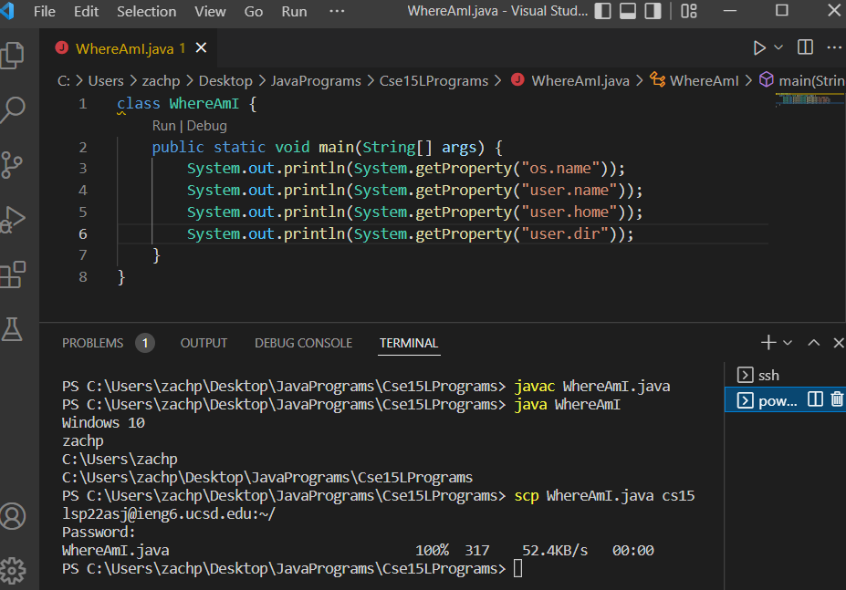

# Week 2 Lab Report 1
## Remote Computer Access
## Zachary Perry zperry@ucsd.edu A16963488
## April 7, 2022

* Step 1: Installing Visual Studio Code 
The first step is to go to
[Visual Studio Download](https://code.visualstudio.com/download) and download VS Code. Follow the instructions to install it on your computer and then open it. VS Code open should look like this.

* Step 2: Remotely connecting 
The second step (if you are using Windows) is to [Install OpenSSH](https://docs.microsoft.com/en-us/windows-server/administration/openssh/openssh_install_firstuse) and follow the instructions to ensure it is working. Next, find your CSE15L account and password [here](https://sdacs.ucsd.edu/~icc/index.php). Type
>$ ssh (your username)@ieng6.ucsd.edu

into the terminal and type "yes" to continue connecting if prompted, otherwise enter your password. Once connected, the terminal should output something similar to this: 

* Step 3: Trying out some commands 
Now that you are connected to the remote computer, test out a few commands such as:
>cd 
cd ~ 
ls -lat 
ls -a 
ls (directory) 
cp  
cat

An example of results from some these commands: 

* Step 4: Moving files with scp 
The next thing to do is to try moving files between the two computers. The command scp must be run on the client(your) computer and copies a file to the remote computer. Use the format:
>scp (file name) (ssh user e-mail):~/

in the terminal and enter your password when it prompts you. Then if you log back into the remote server and use the "ls" command you should see your file listed on the remote computer! Here's an example of this working.

* Step 5: Setting an SSH Key 
Using ssh-keygen, you can save a public and private key to essentially skip having to type your password over and over again in a session. To begin, open the terminal on the client and type:
>$ ssh-keygen 

Enter: 
>/Users/(username)/.ssh/id_rsa 

as the file to save the key. And then make sure to leave the passphrase blank. Next, copy the public key to the .ssh directory by entering:
>$ ssh (username).ieng6.ucsd.edu

Then enter your password. Once on the server type:
>$ mkdir .ssh

Then log out. On the client type:
>$ scp /Users/(username)/.ssh/id_rsa.pub (full e-mail):~/.ssh/authorized_keys

You should now be able to log on to ssh and use scp without having to enter your password every time! Here's an example of it working:

* Step 6: Optimizing Remote Running 
Finally, some tips for optimizing running commands remotely: 
1. You can run commands directly on one line in quotation marks after entering ssh credentials. For example:
>$ ssh (full e-mail) "ls" 

will log in to the remote computer and list the whole home directory in only one line.

2. You can use the up arrow to auto-type the entire last command that was run.

3. You can run multiple commands on the same line by separating them with semicolons.
