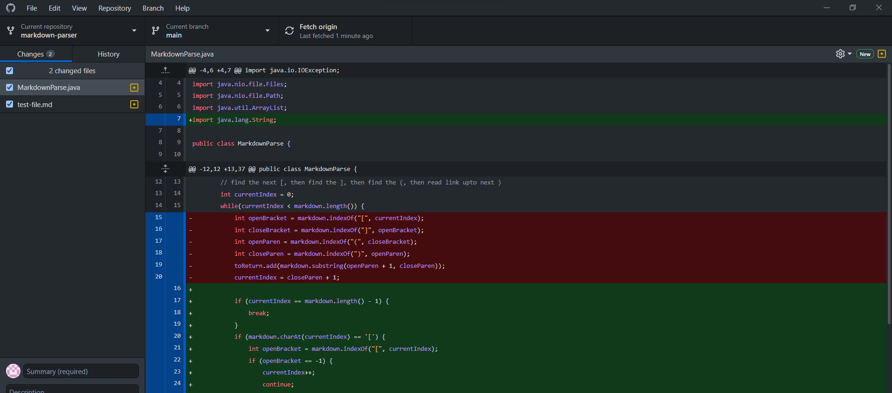

# Week 4 Lab Report 2
## Bugs and Symptoms
## Zachary Perry zperry@ucsd.edu
## April 24, 2022

## Code change #1:
[Test file causing the error](test-file2.md)

This bug occurred because the input file had text that came after the end of the last closing parenthesis of the last link. MarkdownParse.java has a bug when it comes to handling any file that doesn't end explicitly with parenthesis, as the loop continues infinitely and crashes the program.

## Code change #2:
[Test file causing the error](test-file3.md)

This bug occurred because the input file did not have a complete markdown-style link and ended up throwing an IndexOutOfBounds error. MarkdownParse.java did not have any means of catching if the input file did not have a complete link and would therefore crash on those instances.

## Code change #3: 
[Test file causing the error](test-file5.md)

^(should have parsed an empty list)\
This bug occurred because the input file had the correct syntax for a markdown link but had it spaced out across multiple lines to where it should not have counted as a link. MarkdownParse.java did not have a way to check if the link in parenthesis came directly after the closing bracket, and therefore would not take into consideration the amount of space in between the closing bracket and the opening parenthesis.
