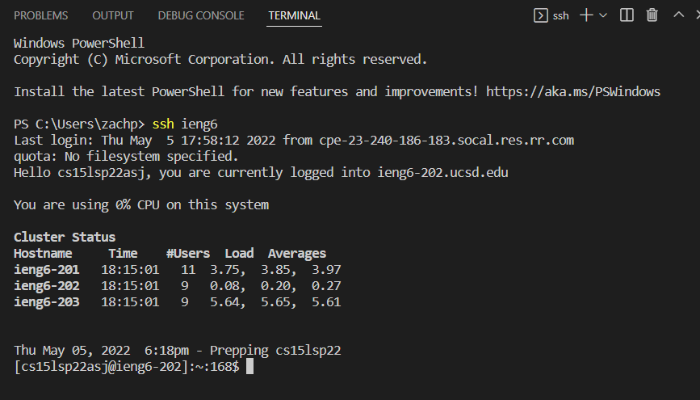

# Week 6 Lab Report 3
## Github, SSH, and SCP
## Zachary Perry zperry@ucsd.edu
## May 8, 2022

## Streamlining ssh Configuration:
Here I created a text file called "config" in my .ssh folder. Inside I created an alias "ieng6" which holds my ssh login info, so now all I have to do is type "ssh ieng6" to log into my ssh account using the alias ieng6. 

## Setup Github Access from ieng6:
We can link our ssh key from a local computer to Github. This is the public key on Github and my private key in my local folder.

Here I push one of the changes to this lab report to the github repository from the command line!

(The file I pushed the change to is the file you are currently viewing.)

## Copying Whole Directories with scp -r
We are able to copy an entire directory of files recursively from a local computer to the remote computer using scp -r.

Next is an image of running junit tests on the remote computer in the directory we just copied over using scp -r.

Finally, copying the whole directory over and running the junit tests on the remote computer in just one command line!

