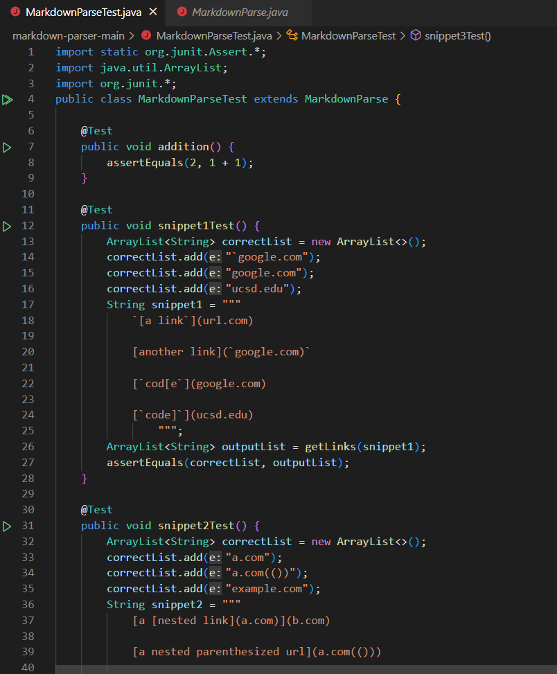
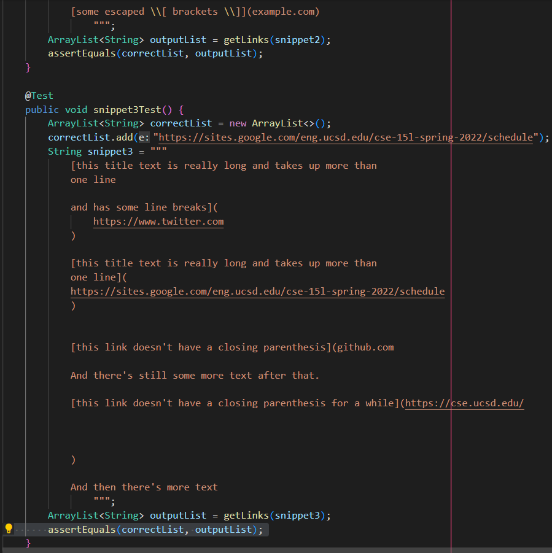
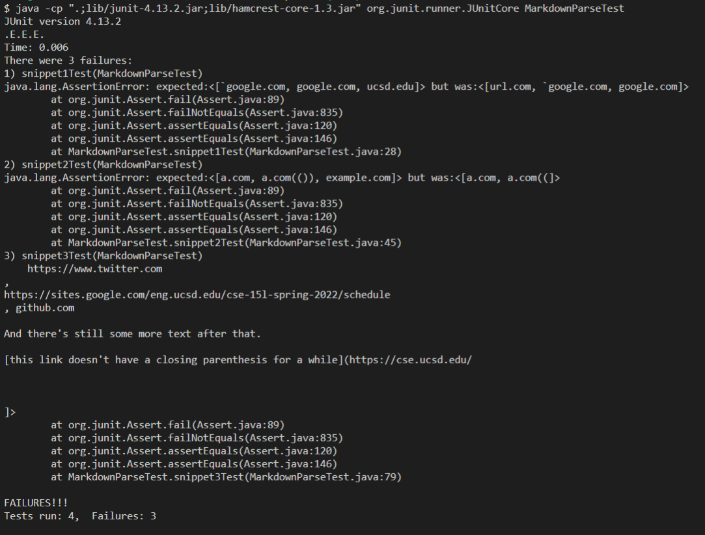
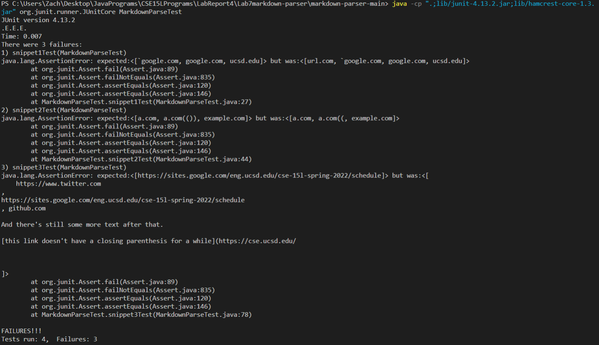

# Week 8 Lab Report 4
## Testing with Junit and Debugging
## Zachary Perry zperry@ucsd.edu
## May 21, 2022
\
[Link to my markdown-parser](https://github.com/ZachPerry197/markdown-parser)\
[Link to our peer group's markdown-parser](https://github.com/NuojinliXu/markdown-parser)

# The code for the tests I wrote(same for both files)

# Tests on my implementation of markdown-parser:

# Tests on our peer group's implementation of markdown-parser:

To make the tests I copied the contents of each of the snippets into a string as a text block and then compared an arraylist with the correct links to the one returned by the getLinks function using assertEquals.
# For Snippet 1:
It should be easy enough to fix this one. All I would really have to do is make sure to add a check for backticks and have the parser ignore whatever is in between two backticks. So yes, I would be able to fix this one with just a few lines.
# For Snippet 2:
This one would be quite difficult to fix since it would require a rework of the entire parser. The problem is my current implementation of the parser doesn't know how to handle nested brackets/parenthesis, so I would have to make it check every character for any of these key symbols and react accordingly. Fixing this bug would definitely take more than 10 lines.
# For Snippet 3:
The main problem with this snippet is that all of the links take up multiple lines. The parser should only count the link if it is all on one line. All I would have to do to fix this bug is put a checker before adding a link to the arraylist to make sure that the link is all on one line, or I could have the method read the markdown file one line at a time. This should be able to be fixed in just a few lines.