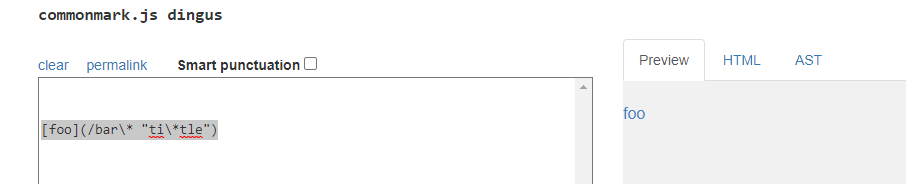
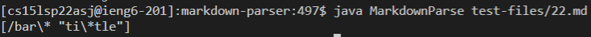
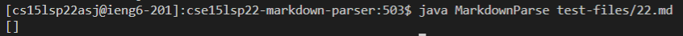
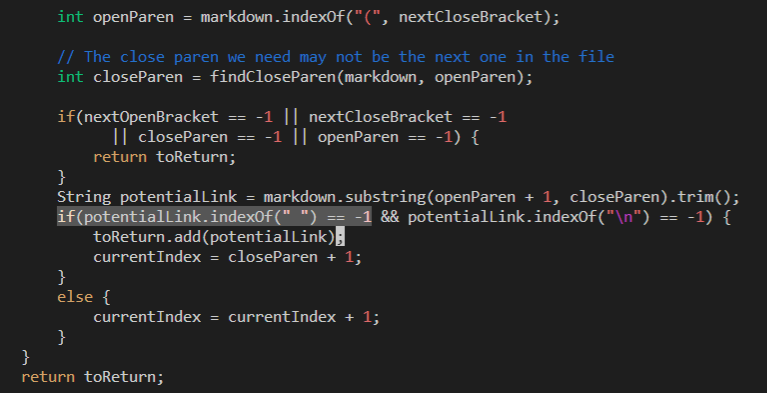
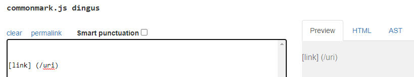
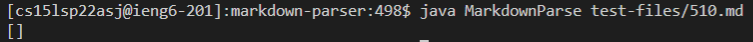
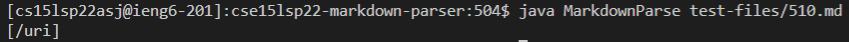
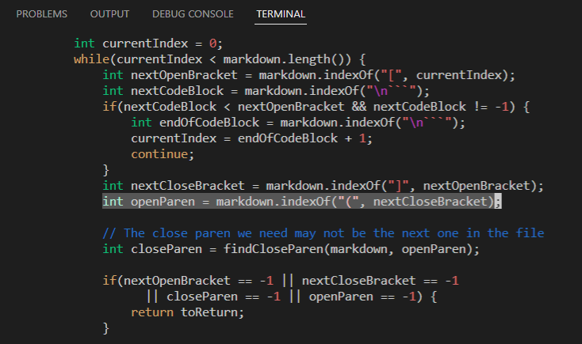

# Week 10 Lab Report 5
## Vimdiff, Comparing Two Possible Implementations of Markdown-parser
## Zachary Perry zperry@ucsd.edu
## June 3rd, 2022
\
I found two different outputs between the provided implementation of markdown-parser and my implementation of markdown-parser using vimdiff to compare the results of all the tests.\
[First test file](https://github.com/nidhidhamnani/markdown-parser/blob/main/test-files/22.md)\
[Second test file](https://github.com/nidhidhamnani/markdown-parser/blob/main/test-files/510.md)
## First test file:
Expected Output:\
\
My Markdown-parser's Output:\
\
Lab 9 Provided Markdown-parser's Output:\
\
Both implementations produced the incorrect output. The parsed link should be [/bar*]. My implementation didn't account for the space and parsed the whole chunk, and the provided implementation completely ignored the link because of the space in the middle. Here is the chunk of code in the provided markdown-parser that is causing this error:\
\
The provided code checks if there is a space in the link, and if so, completely skips over that entire link. What it should do is keep whatever is in the link before the space and cut the rest out.
## Second test file:
Expected Output:\
\
My Markdown-parser's Output:\
\
Lab 9 Provided Markdown-parser's Output:\
\
My implementation produced the correct result and the provided parser did not. The text in the parenthesis should not have counted as a link because there was a space in between the [] and (). Here is the chunk of code in the provided markdown-parser that is causing this error:\
\
The provided implementation searches for the opening parenthesis of the link without ensuring the [] and () are directly next to each other. To fix this, the code should ensure that the "(" comes one index after "]" or else the link should not count.
